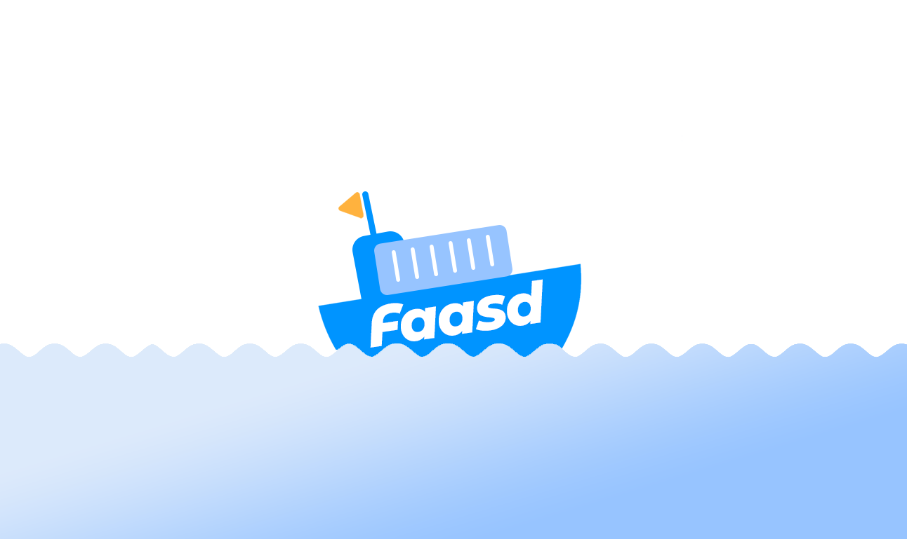

# faasd - a lightweight & portable faas engine

[](https://github.com/sponsors/openfaas)
[](https://github.com/openfaas/faasd/actions)
[](https://opensource.org/licenses/MIT)


faasd is [OpenFaaS](https://github.com/openfaas/) reimagined, but without the cost and complexity of Kubernetes. It runs on a single host with very modest requirements, making it fast and easy to manage. Under the hood it uses [containerd](https://containerd.io/) and [Container Networking Interface (CNI)](https://github.com/containernetworking/cni) along with the same core OpenFaaS components from the main project.



## Use-cases and tutorials

faasd is just another way to run OpenFaaS, so many things you read in the docs or in blog posts will work the same way.

Videos and overviews:

* [Exploring of serverless use-cases from commercial and personal users (YouTube)](https://www.youtube.com/watch?v=mzuXVuccaqI)
* [Meet faasd. Look Ma’ No Kubernetes! (YouTube)](https://www.youtube.com/watch?v=ZnZJXI377ak)

Use-cases and tutorials:

* [Serverless Node.js that you can run anywhere](https://www.openfaas.com/blog/serverless-nodejs/)
* [Simple Serverless with Golang Functions and Microservices](https://www.openfaas.com/blog/golang-serverless/)
* [Build a Flask microservice with OpenFaaS](https://www.openfaas.com/blog/openfaas-flask/)
* [Get started with Java 11 and Vert.x on Kubernetes with OpenFaaS](https://www.openfaas.com/blog/get-started-with-java-openjdk11/)
* [Deploy to faasd via GitHub Actions](https://www.openfaas.com/blog/openfaas-functions-with-github-actions/)
* [Scrape and automate websites with Puppeteer](https://www.openfaas.com/blog/puppeteer-scraping/)

Additional resources:

* The official handbook - [Serverless For Everyone Else](https://gumroad.com/l/serverless-for-everyone-else)
* For reference: [OpenFaaS docs](https://docs.openfaas.com)
* For use-cases and tutorials: [OpenFaaS blog](https://openfaas.com/blog/)
* For self-paced learning: [OpenFaaS workshop](https://github.com/openfaas/workshop/)

### About faasd

* faasd is a static Golang binary
* uses the same core components and ecosystem of OpenFaaS
* uses containerd for its runtime and CNI for networking
* is multi-arch, so works on Intel `x86_64` and ARM out the box
* can run almost any other stateful container through its `docker-compose.yaml` file

Most importantly, it's easy to manage so you can set it up and leave it alone to run your functions.

[](https://www.youtube.com/watch?v=WX1tZoSXy8E)

> Demo of faasd running asynchronous functions

Watch the video: [faasd walk-through with cloud-init and Multipass](https://www.youtube.com/watch?v=WX1tZoSXy8E)

### What does faasd deploy?

* faasd - itself, and its [faas-provider](https://github.com/openfaas/faas-provider) for containerd - CRUD for functions and services, implements the OpenFaaS REST API
* [Prometheus](https://github.com/prometheus/prometheus) - for monitoring of services, metrics, scaling and dashboards
* [OpenFaaS Gateway](https://github.com/openfaas/faas/tree/master/gateway) - the UI portal, CLI, and other OpenFaaS tooling can talk to this.
* [OpenFaaS queue-worker for NATS](https://github.com/openfaas/nats-queue-worker) - run your invocations in the background without adding any code. See also: [asynchronous invocations](https://docs.openfaas.com/reference/triggers/#async-nats-streaming)
* [NATS](https://nats.io) for asynchronous processing and queues

faasd relies on industry-standard tools for running containers:

* [CNI](https://github.com/containernetworking/plugins)
* [containerd](https://github.com/containerd/containerd)
* [runc](https://github.com/opencontainers/runc)

You can use the standard [faas-cli](https://github.com/openfaas/faas-cli) along with pre-packaged functions from *the Function Store*, or build your own using any OpenFaaS template.

### When should you use faasd over OpenFaaS on Kubernetes?

* To deploy microservices and functions that you can update and monitor remotely
* When you don't have the bandwidth to learn or manage Kubernetes
* To deploy embedded apps in IoT and edge use-cases
* To distribute applications to a customer or client
* You have a cost sensitive project - run faasd on a 1GB VM for 5-10 USD / mo or on your Raspberry Pi
* When you just need a few functions or microservices, without the cost of a cluster

faasd does not create the same maintenance burden you'll find with maintaining, upgrading, and securing a Kubernetes cluster. You can deploy it and walk away, in the worst case, just deploy a new VM and deploy your functions again.

You can learn more about supported OpenFaaS features in the [ROADMAP.md](/docs/ROADMAP.md)

## Learning faasd

The faasd project is MIT licensed and open source, and you will find some documentation, blog posts and videos for free.

However, "Serverless For Everyone Else" is the official handbook and was written to contribute funds towards the upkeep and maintenance of the project.

### The official handbook and docs for faasd

<a href="https://gumroad.com/l/serverless-for-everyone-else">
</a>

You'll learn how to deploy code in any language, lift and shift Dockerfiles, run requests in queues, write background jobs and to integrate with databases. faasd packages the same code as OpenFaaS, so you get built-in metrics for your HTTP endpoints, a user-friendly CLI, pre-packaged functions and templates from the store and a UI.

Topics include:

* Should you deploy to a VPS or Raspberry Pi?
* Deploying your server with bash, cloud-init or terraform
* Using a private container registry
* Finding functions in the store
* Building your first function with Node.js
* Using environment variables for configuration
* Using secrets from functions, and enabling authentication tokens
* Customising templates
* Monitoring your functions with Grafana and Prometheus
* Scheduling invocations and background jobs
* Tuning timeouts, parallelism, running tasks in the background
* Adding TLS to faasd and custom domains for functions
* Self-hosting on your Raspberry Pi
* Adding a database for storage with InfluxDB and Postgresql
* Troubleshooting and logs
* CI/CD with GitHub Actions and multi-arch
* Taking things further, community and case-studies

View sample pages, reviews and testimonials on Gumroad:

["Serverless For Everyone Else"](https://gumroad.com/l/serverless-for-everyone-else)

### Deploy faasd

The easiest way to deploy faasd is with cloud-init, we give several examples below, and post IaaS platforms will accept "user-data" pasted into their UI, or via their API.

For trying it out on MacOS or Windows, we recommend using [multipass](https://multipass.run) to run faasd in a VM.

If you don't use cloud-init, or have already created your Linux server you can use the installation script as per below:

```bash
git clone https://github.com/openfaas/faasd --depth=1
cd faasd

./hack/install.sh
```

> This approach also works for Raspberry Pi

It's recommended that you do not install Docker on the same host as faasd, since 1) they may both use different versions of containerd and 2) docker's networking rules can disrupt faasd's networking. When using faasd - make your faasd server a faasd server, and build container image on your laptop or in a CI pipeline.

#### Deployment tutorials

* [Use multipass on Windows, MacOS or Linux](/docs/MULTIPASS.md)
* [Deploy to DigitalOcean with Terraform and TLS](https://www.openfaas.com/blog/faasd-tls-terraform/)
* [Deploy to any IaaS with cloud-init](https://blog.alexellis.io/deploy-serverless-faasd-with-cloud-init/)
* [Deploy faasd to your Raspberry Pi](https://blog.alexellis.io/faasd-for-lightweight-serverless/)

Terraform scripts:

* [Provision faasd on DigitalOcean with Terraform](docs/bootstrap/README.md)
* [Provision faasd with TLS on DigitalOcean with Terraform](docs/bootstrap/digitalocean-terraform/README.md)

### Function and template store

For community functions see `faas-cli store --help`

For templates built by the community see: `faas-cli template store list`, you can also use the `dockerfile` template if you just want to migrate an existing service without the benefits of using a template.

### Community support

Commercial users and solo business owners should become OpenFaaS GitHub Sponsors to receive regular email updates on changes, tutorials and new features.

If you are learning faasd, or want to share your use-case, you can join the OpenFaaS Slack community.

* [Become an OpenFaaS GitHub Sponsor](https://github.com/sponsors/openfaas/)
* [Join the weekly Office Hours call](https://docs.openfaas.com/community/)

### Backlog, features, design limitations and any known issues

For open backlog items, shipped features, design limitations and any known issues, see [ROADMAP.md](docs/ROADMAP.md)

Want to build a patch without setting up a complete development environment? See [docs/PATCHES.md](docs/PATCHES.md)

Are you looking to hack on faasd? Follow the [developer instructions](docs/DEV.md) for a manual installation, or use the `hack/install.sh` script and pick up from there.
